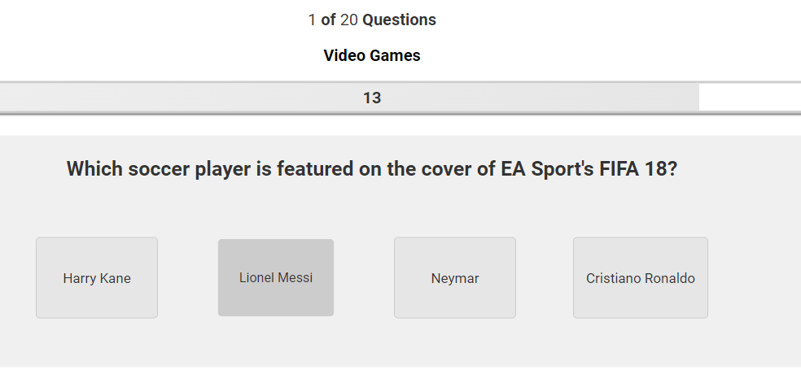

# Trivia Quiz: General Knowledge Quiz

! Placeholder for center image, 

This interactive quiz is crafted for anyone with a keen interest in quizzes, covering a wide array of topics such as general knowledge, video games, science & nature, and films. It features 20 diverse questions, each accompanied by four possible answers for participants to select from. As participants navigate through the quiz, questions will appear in a random order, ensuring a unique experience for each user. Instant feedback is provided after each selection, indicating whether the chosen answer is correct or incorrect, and the correct answer is displayed for any wrong choices. Participants are allotted a maximum of 15 seconds per question, with a countdown timer and a diminishing bar visually tracking the time left. At the quiz's conclusion, participants can view their total correct answers, their overall score as a percentage, and their score converted into a grade, following typical grading boundaries.

# Contents

# Target Audience 
*   This quiz is aimed at anyone who has a keen interest in quizzes. This quiz is designed as a brief assessment tool to evaluate knowledge and retention across various subjects. It's also a fun exercise for quiz enthusiasts who wish to test how much they remember from diverse topics of interest.

# User Expectations
*   This is a interactive quiz that is able to be completed on desktop, tablet and mobile devices.
*   The quiz will load quickly on all devices.
*   The quiz is fully responsive.
*   Feedback from each question attempted.
*   Clear indication of time left to answer each question via a timer bar and number
*   Clear indication of which question they are on and how many questions in total. 
*   Overall feedback with a mark, percentage and grade at the end.
*   The ability to restart the quiz once completed.

# User Stories

* As a visitor:

    * I am looking for an easy to navigate test, that is responsive and easy to interact with on all devices.
    * I will see a start button and a header detailing the content and subject of the quiz.
    * I will click start and see the instructions for the quiz.
    * The Instructions will be clearly laid out and easy to follow.
    * I will see two buttons at the bottom of the rules inviting me to start the test or quit.
    * The quiz will begin when I click the start button.
    * I will see the question number and total at the top of the quiz area.
    * I will see a timer bar indicating how long I have left on that question.
    * I will see a timer number counting down to show how long I have left on that quesiton.
    * I will see the question being asked.
    * I will see 4 possible answers.
    * Once an answer is selected I will see if I am correct instantly by showing the answer correct answer in green.
    * If incorrect I will see my answer selected turn red and the correct answer show in green.
    * The next button will appear when I have selected an answer and the timer and timer bar will stop.
    * I will complete all 20 questions.
    * After completing all 20 questions a results window will appear showing me my overall score, percentage and grade achieved.
    * I am able to restart the quiz again.
    * The question order and options in each question will be random.
    * I can see links in the footer to social media. 

# Design

## Typography
*   For my font choice I selected Roboto which was imported from Google Fonts. This font was selected because it is simple and clear to read. The purpose of the quiz is to test your knowledge and I did not want a font that distracts away from this. 

## Colour Scheme
- I decided on a simple colour scheme that was consistent throughout the quiz. Text black for the question on a white/light grey background. I did not want a design and colour scheme that distracted away from the quiz content. The colour scheme is displayed in the features section below.

# Features

## Existing Features:

### Header and Footer
*   Header element detailing the quiz title and a interactive footer that will direct users to my social media sites.

### Interactive Start Button
*   The users will be greeted on the home page with an interactive start button that has a hover effect and opens up the guidelines window when clicked.

### Question number in the Quiz Area
*   The users will see the question number they are on and how many questions there are in the header of their quiz area.

### Timer bar and number
*   The user will see how many seconds left there are to answer the current question. This will also be displayed in a timer bar.

### Selecting correct answer 
*   Selecting the correct answer will stop the timer and timer bar, display the answer as green and display a button to move to the next question.

### Incorrect answer selection
*   Selecting an incorrect answer will stop the timer and the timer bar, display the incorrect answer selected as red and the correct answer as green.

### Results Area
*   The results area will show the total number of questions correct, calculate the percentage and use the percentage to generate a grade for the user.

### Random Question Order Generation
*   The 20 questions in the quiz appear in a random order every time the quiz is attempted to ensure the user does not just learn the sequence of answers.

### Random Answer Order Generation
*   The answers will appear in a random order for each question every time the quiz is attempted. This ensures the user does not just learn the sequence of answers.

IMAGE OF RANDOM ANSWER EXAMPLES X2

## Features Left To Implement and Future Development
### Below are features that I would like to integrate into the project:
*   Greater selection of questions and/or the use of an API to generate the questions.
*   Responsive test design which selects the next quesion based on the success of the user in the previous few questions.
*   Level of difficulty questions that the user can select which will in turn dictate the demand of the questions being asked.

## Wireframes

WIREFRAMES IMAGES HERE

## Framework, Languages and Programs Used

1. [Google Fonts](https://fonts.google.com/)
    *Google Fonts was used to import different font styles to be used in styling of the website.

    ADD ADDITIONAL FRAMEWORKS HERE

# Testing 

*   The website and interactive quiz has been tested through the following methods below. These tests have taken place on the hosted server during development and on the deployed site on GitHub pages. After deploying the website to GitHub Pages the webiste was further tested by friends, family and students at my school to check its UX and functionality on both desktop computers and the variety of mobile devices.

## Validator testing:

TESTING HERE

## Unfixed Bugs
*   On desktop devices: Tabbing out of the quiz once started loses the window focus. This causes the timer bar to stop counting down. The numbers work correctly. This will be corrected in the future by ensuring when the quiz has started, the window is always the focus even if tabbed out.

## Lighthouse results

*   I have used the developer tools in google chrome to test each page in my website for performance, accessibility, best practice and SEO. Below is an exmaple of the homepage.

### Mobile
IMAGE OF MOBILE
### Desktop
IMAGE OF DESKTOP

## Responsiveness
*   In order to fully test the responsiveness of the web application I performed further tests on different devices and browsers. These were:
    *Browsers:
        * Google Chrome
        * Safari
        * MS Edge
        * Firefox

    * Devices:
        * IPhone 14pro
        * IPhone 12 Mini
        * IPad Pro 12.9inc
        * Mac Laptop
        * Windows Desktop PC
        * Windows Laptop

## Features Tested

| Feature   | Expected Outcome | Testing Performed  | Result | Pass or Fail |
| :---      |   :----:         |        :----:      | :----: |    :----:    
| Start Button | When clicked   test instructions   appear. | Clicked Start | Instructions shown  | Pass      |
| Quit Test Button  | When clicked   the Test ends   takes user to start.   | Clicked Quit | Navigate to start   | Pass        |
| Start Test Button | When clicked   Test window shown   the test begins   | Clicked Start | Test begins  | Pass        |
| Question Number | When test begins   question number displayed   counts up as you progress questions.| Moved through questions | Number counts up | Pass        |
| Timer Bar | When test begins   timer bar decreases.    | Started the test | Timer bar decreases | Pass        |
| Timer     | When test begins   timer decreases from 15   down to 0. | Started the test | Timer decreases  | Pass    |
| No answer selected | If no answer is   selected when timer   ends, correct answer   shown and no score acquired. | Did not select and answer | No point awarded and   correct answer shown | Pass    |
| Next Button | When test begins the   next button will only display when   an answer is selected   and when clicked takes   user to next questions. | Clicked answer | Next button appears and takes   user to next questions | Pass   |
| Results Window | After completing the Test   the results window will show. | Completed all questions | Results window shown | Pass    |
| Results Data | Results window shows total score   Percentage achieved and   what grade achieved. | Completed questions to get different scores | Correct score, percentage and   grade shown | Pass    |
|Restart Button | Click button to restart Test | Clicked restart | Test restarts | Pass  |
Social Media | Click social media icons takes   user to social media site. | Clicked social media icons. | Navigated to social media. | Pass  |

# Deployment

* CHANGES WHEN DEPLOYED 

# Credits 

* [W3Schools](http://www.w3schools.com/) was used as a general source of knowledge.

